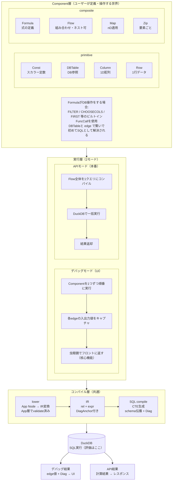
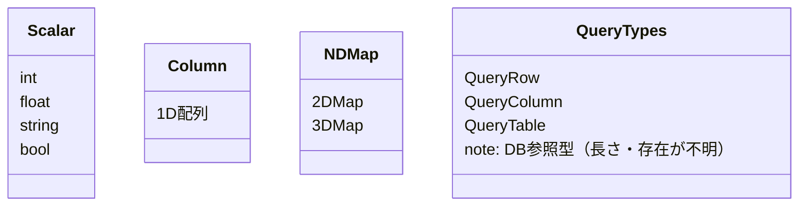
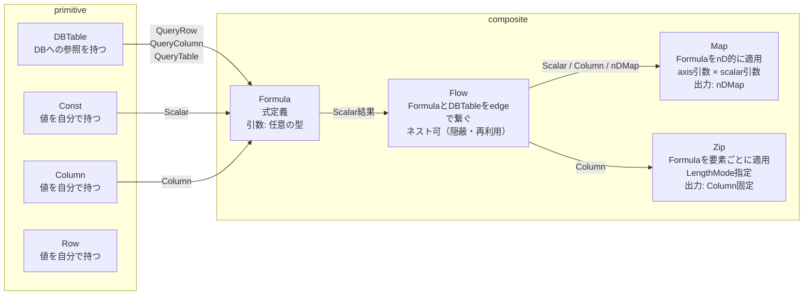
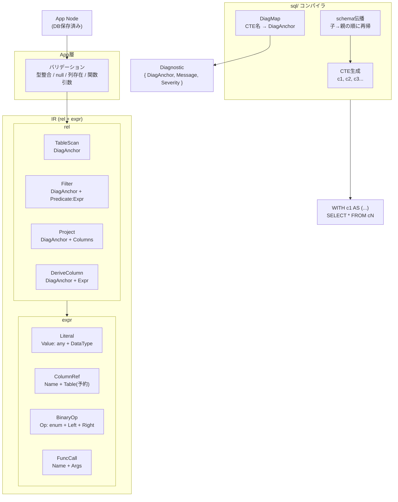

# formuflow アーキテクチャ

## 全体構造

---

## データ型

---

## Component詳細

---

## コンパイル層詳細

---

## 実行モード比較

| | デバッグモード | APIモード |
|---|---|---|
| 用途 | UIで確認・デバッグ | 本番APIとして呼び出し |
| 実行単位 | Component単位で順次実行 | Flow全体を1クエリ |
| edge値 | キャプチャして返す（虫眼鏡） | 返さない |
| パフォーマンス | 捨てる | 優先 |
| SQL本数 | Component数分 | 1本 |
