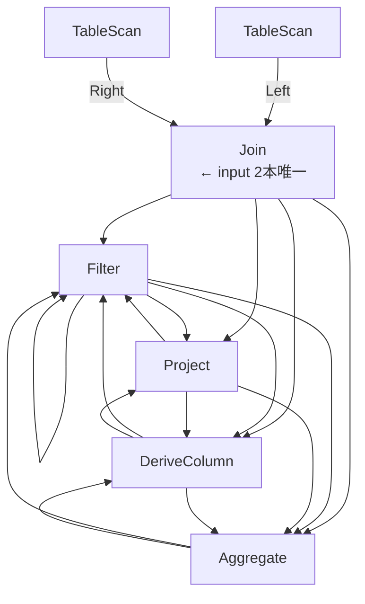
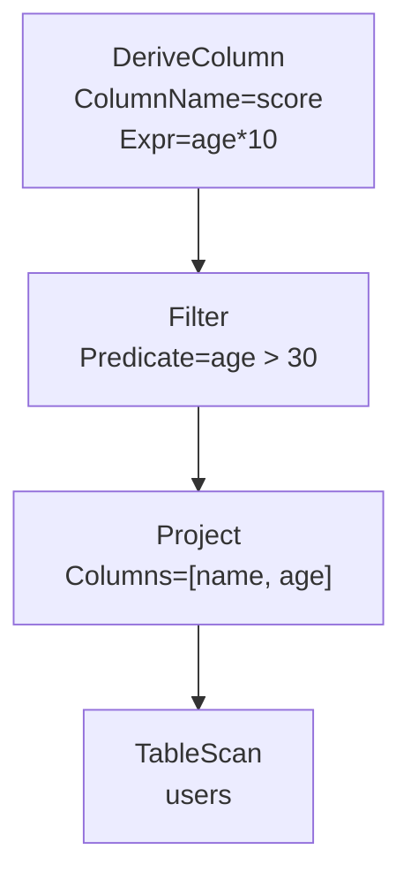

# formuflow IR ノード解説

## 基本原則

- **1ノード = CTE 1個**
- 木は**下から上**（TableScan → 最上ノード）の順でコンパイル
- 各ノードは「テーブルを受け取って、テーブルを返す」
- 実際の評価はDuckDBが行う。IRはSQL文字列を作るだけ

---

## ノード一覧

| ノード | input | output（スキーマの変化） | 役割 |
|---|---|---|---|
| TableScan | なし（葉） | テーブルの全列 | FROM どこ？ |
| Filter | 1本 | inputと同じ列（行数が減る） | SELECT する行は WHERE？ |
| Project | 1本 | 指定した列のみ（列が減る） | SELECT 何？ |
| DeriveColumn | 1本 | inputの全列 + 新しい1列 | どう計算する？ |
| Join | **2本**（Left + Right） | Leftの全列 + Rightの全列 | ≒ つよつよTableScan |
| Aggregate | 1本 | GroupBy列 + 集約結果列のみ | 複数行どう集約する？ |

## 接続ルール

制約はシンプル：

- **TableScan** だけが葉（inputなし）
- **Join** だけ input が2本（Left / Right）
- **Filter / Project / DeriveColumn / Aggregate** は input 1本、かつ何でも親になれる

つまり `(TableScan | Join) → {Filter | Project | DeriveColumn | Aggregate}` が何段でも積める。`Filter → DeriveColumn → Filter → Aggregate` みたいな繰り返しも全然あり。



---

## 各ノードの詳細

### TableScan — テーブルを読む

input なし。葉ノード（木の末端）。

```
TableScan("users")
↓
c1 AS (
  SELECT * FROM users
)
```

---

### Filter — 行を絞る

Predicate（条件式）を満たす行だけ残す。SQLの WHERE 句。

```
Filter(Predicate = age > 30)
  └── TableScan("users")
↓
c2 AS (
  SELECT * FROM c1
  WHERE age > 30
)
```

---

### Project — 列を選ぶ

既存の列の中から使う列だけ選ぶ。SQLの SELECT col1, col2。
新しい列は作れない（それは DeriveColumn の仕事）。

```
Project(Columns = [name, age])
  └── TableScan("users")
↓
c2 AS (
  SELECT name, age
  FROM c1
)
```

---

### DeriveColumn — 列を計算して追加

式を評価した結果を新しい列として追加。SELECT * に1列足すイメージ。

```
DeriveColumn(ColumnName="score", Expr=age*10)
  └── TableScan("users")
↓
c2 AS (
  SELECT *, age * 10 AS score
  FROM c1
)
```

複数列を追加したいときは積み重ねる：

```
DeriveColumn(ColumnName="bmi", Expr=weight/height^2)
  └── DeriveColumn(ColumnName="score", Expr=age*10)
        └── TableScan("users")
```

---

### Join — 2テーブルを横に並べる

**inputが2本**になる唯一のノード（Phase 3で追加）。
2テーブルの列を合わせて、selectできる列が増える。

#### CROSS JOIN — 全組み合わせ

条件なし。Left × Right の全組み合わせ行を作る。
Map（全組み合わせ演算）の実現に使う。

```
Join(CROSS)
  ├── TableScan("rpm_table")    ← Left
  └── TableScan("coef_table")  ← Right
↓
c3 AS (
  SELECT * FROM c1, c2
)
```

rpm_table が3行、coef_table が4行なら → 3×4=12行になる。

#### INNER JOIN / LEFT JOIN — 条件付き結合

On（結合条件の式）を指定する。

```
Join(INNER, On = c1.id = c2.user_id)
  ├── TableScan("orders")
  └── TableScan("users")
↓
c3 AS (
  SELECT * FROM c1
  INNER JOIN c2 ON c1.id = c2.user_id
)
```

---

### Aggregate — GROUP BY + 集約

行をグループにまとめて集約関数（SUM, AVG 等）を適用（Phase 3で追加）。

```
Aggregate(GroupBy=[department], Aggs=[SUM(salary) AS total])
  └── TableScan("employees")
↓
c2 AS (
  SELECT department, SUM(salary) AS total
  FROM c1
  GROUP BY department
)
```

GroupBy が空なら全体を1行に集約：

```
Aggregate(GroupBy=[], Aggs=[COUNT(*) AS n])
↓
c2 AS (
  SELECT COUNT(*) AS n
  FROM c1
)
```

---

## 木の例（複合）



生成SQL：

```sql
WITH
c1 AS (
  SELECT * FROM users
),
c2 AS (
  SELECT name, age FROM c1
),
c3 AS (
  SELECT * FROM c2 WHERE age > 30
),
c4 AS (
  SELECT *, age * 10 AS score FROM c3
)
SELECT * FROM c4
```

---

## Phase 2 vs Phase 3

| ノード | Phase |
|---|---|
| TableScan | 2 |
| Filter | 2 |
| Project | 2 |
| DeriveColumn | 2 |
| **Join** | **3** |
| **Aggregate** | **3** |