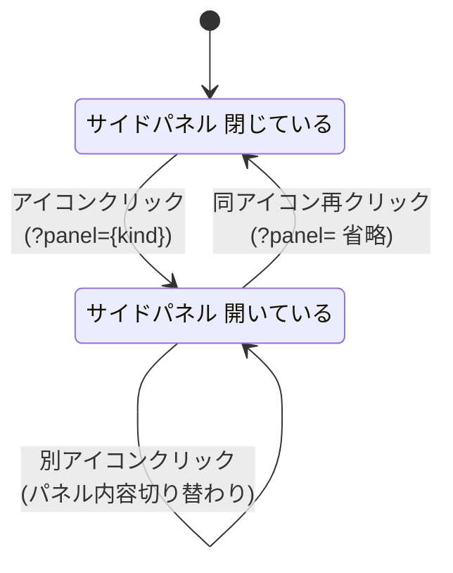
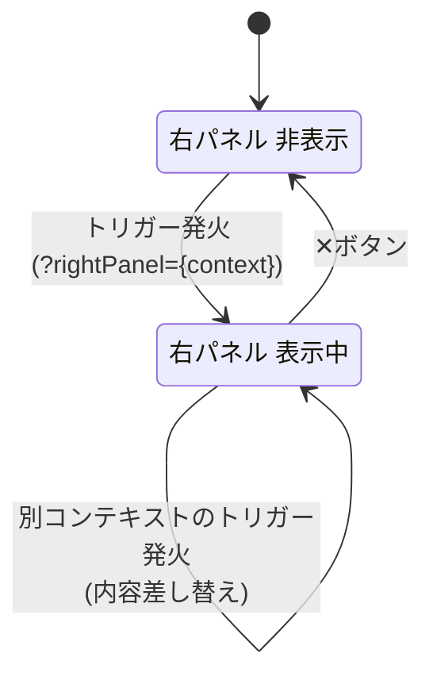
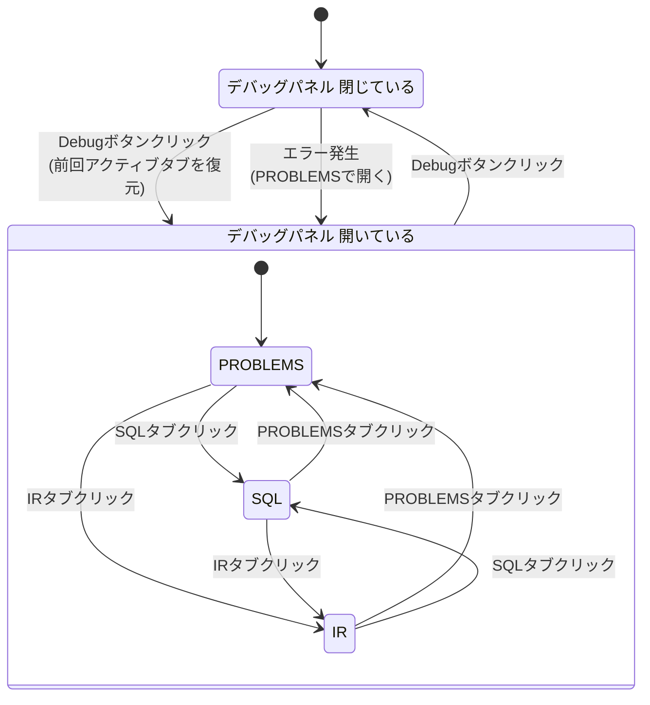
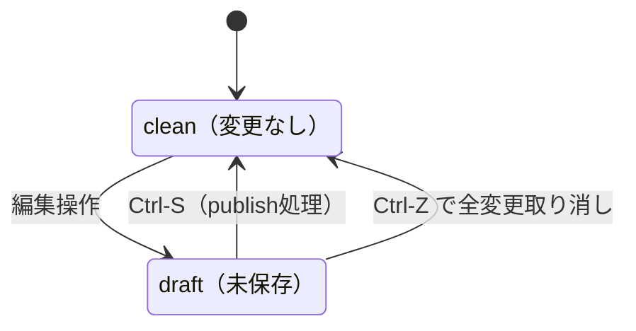

# 01 — アプリ全体レイアウト仕様

対応モック: `docs/mockups/01-layout.html`

---

## 全体構造

VSCode型レイアウト。縦方向にメニューバー・アプリ本体・ステータスバーの3層。アプリ本体は横方向に分割。

```
┌─────────────────────────────────────────────────────┐
│  メニューバー（30px）                                  │
├──┬────────┬───────────────────────────────┬─────────┤
│  │        │  タブバー（35px）               │         │
│左│ サイド │────────────────────────────────│ 右      │
│端│ パネル │                                │ パネル  │
│ア│        │  メインエリア（キャンバス等）    │（任意）  │
│イ│        │                                │         │
│コ│        │────────────────────────────────│         │
│ン│        │  デバッグパネル                │         │
│バ│        │                                │         │
│ー│        │                                │         │
├──┴────────┴───────────────────────────────┴─────────┤
│  ステータスバー（22px）                               │
└─────────────────────────────────────────────────────┘
```

---

## メニューバー

- 高さ: `30px`、固定
- 項目: `formuflow`（タイトル）、`File`、`Edit`、`View`、`Run`、`Help`

---

## 左端アイコンバー

- 幅: 固定 `48px`
- VSCodeのアクティビティバーと同じ挙動

### アイコン一覧

| アイコン | 内容 |
|---|---|
| ⊟ | Componentツリー |
| ⌕ | 検索 |
| ⊕ | DB接続管理 |
| ⚙ | 設定（下端固定） |

### 挙動
- クリックでサイドパネルを開く（同アイコンを再クリックでトグル閉じ）
- アクティブなアイコンは左端に `2px` のアクセントカラーバーを表示
- アイコンバー自体は常に表示（パネルを閉じても消えない）

---

## サイドパネル

- デフォルト幅: `240px`
- 右端ドラッグでリサイズ可（最小 `160px`、最大 `480px`）
- アイコンバーのトグルで幅 `0` にアニメーション収納（`transition: width 0.18s`）
- パネルはメインエリアを**押し広げる**（オーバーレイではない）

### Componentツリーパネル

```
▼ builtin
  ▶ math
  ▶ sql
▼ user
  ▼ flows
    ⇢ GetIVChar          ●  ← 未保存
    ⇢ CalcMotorGain
  ▼ formulas
    fx CalcGainBandwidth
    fx FilterIV          ●
    fx OldCalc               ← 孤立Component（名前を灰色表示）
  ▼ dbtables
    DB transistor_iv_table
  ▶ consts
```

- 未保存（draft）のComponentはエントリ右端に `●` を表示
- どこからも参照されていない孤立Componentは名前を灰色表示
- ダブルクリックで該当ページをタブで開く

---

## メインエリア

### タブバー

- 高さ: `35px`、固定
- VSCode準拠の挙動:
  - タブが多くなったら横スクロール（1列固定、折り返しなし）
  - アクティブタブは常に表示（スクロール位置が自動調整）
  - タブ幅は可変・最小幅あり（タイトルが省略される）
  - `×` ボタンはhover時に表示
  - 未保存（draft）のタブはタイトル左に `●` を表示

### タブで開くページ

| ページ | URL |
|---|---|
| Flowキャンバス | `/flows/:id` |
| Formula編集 | `/formulas/:id` |
| DatabaseTable設定 | `/dbtables/:id` |
| DefaultInput設定 | `/inputs/:id` |

### 遷移ルール
- Componentツリーからダブルクリック → 該当ページをタブで開く
- Flowキャンバス上でノードをダブルクリック → 該当Componentのページをタブで開く
- ノードの鉛筆アイコン（✏）クリック → 該当Componentのページをタブで開く

### キャンバス内ボタン（Flowキャンバス時）
- 右上に `KaTeX`（KaTeX表示切替）、`⊡`（全体フィット）ボタン
- 左下にノードをドラッグで移動可能

---

## ノードのアクションボタン

Flowキャンバス上の各ノードにhover時に表示。

### 表示位置
- ノード右上コーナーの**枠外**（`top: -26px`）に浮かぶ
- ノード本体とボタンを `.node-wrapper` で包み、wrapper全体にhover判定をかけることでボタンへの移動中も消えない

### ボタン
| ボタン | 動作 |
|---|---|
| 👁 Inspect | 右パネルをInspectモードで開く。開いている場合は閉じる |
| ✏ 編集 | 該当Componentのページを新しいタブで開く |

---

## 右パネル

- 普段は非表示（幅 `0`）
- イベント発火で右からスライドして出る（`transition: width 0.18s`）
- デフォルト幅: `280px`、左端ドラッグでリサイズ可（最小 `180px`、最大 `560px`）
- 右パネルはメインエリアを**押し広げる**（オーバーレイではない）
- 右上の `✕` ボタンで閉じる
- 中身は常に1つ（コンテキストが変わったら差し替え）

### 表示コンテキスト

| コンテキスト | `?rightPanel=` | 発火イベント | 対象ページ |
|---|---|---|---|
| Formula Inspect | `inspect` | Flowキャンバス上ノードの👁クリック | `/flows/:id` |
| Formula Test | `test` | Formulaページヘッダー右端のTestボタンクリック | `/formulas/:id` |
| 配列系エッジ値 | `edge-value` | 配列系エッジの値アイコンクリック | `/flows/:id` |
| ノードプロパティ編集 | `node-props` | ノードのプロパティアイコンクリック（将来） | `/flows/:id` |

> URL制御: `?rightPanel=test&formulaId=xxx` 形式。コンテキスト追加も同じ仕組みで対応。

---

## デバッグパネル

- 高さ: デフォルト `200px`、上端ドラッグでリサイズ可（最小 `80px`、最大 `500px`）
- デフォルト: 閉じた状態
- 現在のタブでエラー発生時: 自動でオープン
- キャンバス右下の `Debug` ボタンでトグル

### タブ構成

| タブ | 内容 |
|---|---|
| `PROBLEMS` | エラー・警告の一覧 |
| `SQL` | 生成SQL・実行計画 |
| `IR` | AST / IR dump |

### PROBLEMSフォーマット

```
✕ [Edge {ComponentName: EdgeName} — {ComponentName: EdgeName}]: type mismatch: Col → F64
⚠ [{ComponentName}]: implicit cast F64 → I32 may lose precision
```

- クリック → 対象のComponentまたはEdgeを**画面中央にフォーカス** + 赤枠表示
- 表示対象は**現在開いているタブのエラーのみ**

---

## ステータスバー

- 高さ: `22px`、固定
- 背景色: アクセントカラー（`#6366f1`）
- 左側: アプリ名、ブランチ名
- 右側: エラー件数、DuckDB接続状態、文字コード

---

## 保存モデルとの対応

レイアウト上の `●` 表示はdraft/publishedの2状態に基づく。

- **draft**: 変更のたびにバックエンドへ自動送信。UIテスト実行時に使用
- **published**: Ctrl-S で確定。API呼び出し時に使用

| UI上の表示 | 意味 |
|---|---|
| タブの `●` | そのページに未保存（draft）の変更がある |
| ツリーエントリの `●` | そのComponentに未保存（draft）の変更がある |

画面更新・再訪問時に未保存のComponentがあれば再開モーダルを表示する。詳細はマスタードキュメント「保存モデル」セクション参照。

---

## URLルーティング設計

UIの各エリアの表示状態はURLで完全に表現できる。これにより画面更新後の状態復元・ディープリンク共有が可能。

### URL構造

```
/{mainPage}?panel={sidePanel}&debug={debugTab}&rightPanel={rightPanel}&rightTarget={id}
```

### 各パラメータ

| パラメータ | 対応するUIエリア | 値の例 |
|---|---|---|
| パス（`/{mainPage}`） | メインエリア（タブ） | `/flows/:id` `/formulas/:id` `/dbtables/:id` `/inputs/:id` |
| `?panel=` | サイドパネル（アイコンバー選択） | `tree` `search` `db` `settings` |
| `?debug=` | デバッグパネルのアクティブタブ | `problems` `sql` `ir`（なければ閉じた状態） |
| `?rightPanel=` | 右パネルのコンテキスト | `inspect` `test` `edge-value` `node-props` |
| `?rightTarget=` | 右パネルの対象ID | ノードID・エッジID等 |

### 具体例

```
# Flowキャンバス、ツリーパネル開、右パネル閉
/flows/get_iv_char?panel=tree

# Flowキャンバス、PROBLEMSタブ開
/flows/get_iv_char?panel=tree&debug=problems

# IT向け：SQLタブ開
/flows/get_iv_char?panel=tree&debug=sql

# Formulaページ、Testパネル開
/formulas/calc_gain?panel=tree&rightPanel=test&rightTarget=calc_gain

# DBTable設定、パネル閉
/dbtables/transistor_iv_table
```

### タブの複数開き

複数タブの状態はURLだけでは表現しきれないため、タブの開き状態はセッションストレージで管理する。URLはあくまで「現在アクティブなタブ」を示す。

---

## 寸法まとめ

| 要素 | 値 |
|---|---|
| メニューバー高さ | `30px` |
| アイコンバー幅 | `48px`（固定） |
| サイドパネル幅 | デフォルト `240px`、範囲 `160px`〜`480px` |
| タブバー高さ | `35px` |
| 右パネル幅 | デフォルト `280px`、範囲 `180px`〜`560px` |
| デバッグパネル高さ | デフォルト `200px`、範囲 `80px`〜`500px` |
| ステータスバー高さ | `22px` |

---

## State Diagrams

### D-01-1: サイドパネルの表示状態



### D-01-2: 右パネルの共通挙動

> 各コンテキストへの遷移トリガーは呼び出し元spec（`06-formula-editor.md`等）で定義する。ここではopen/closeの共通挙動のみ記載。



### D-01-3: デバッグパネルの表示状態



### D-01-4: Componentの保存状態



> `published` は状態ではなく「Ctrl-S時の処理」。UI上の `●` 表示はdraftと対応する。