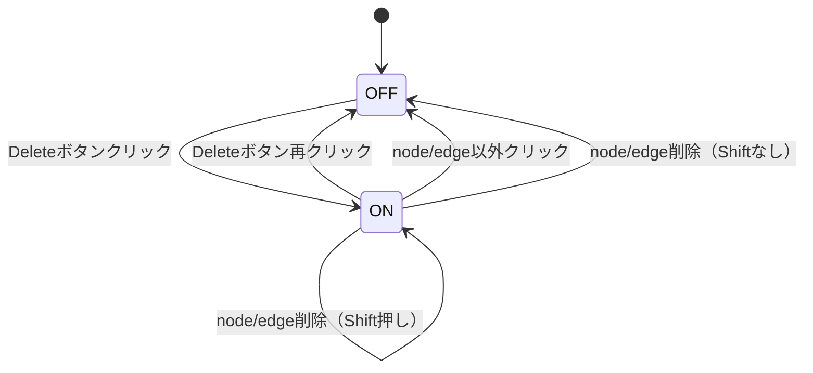
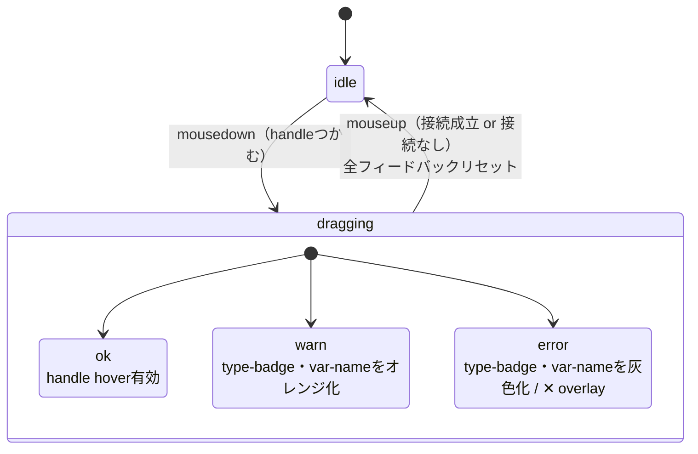
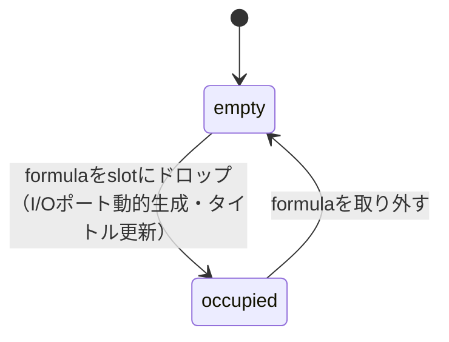
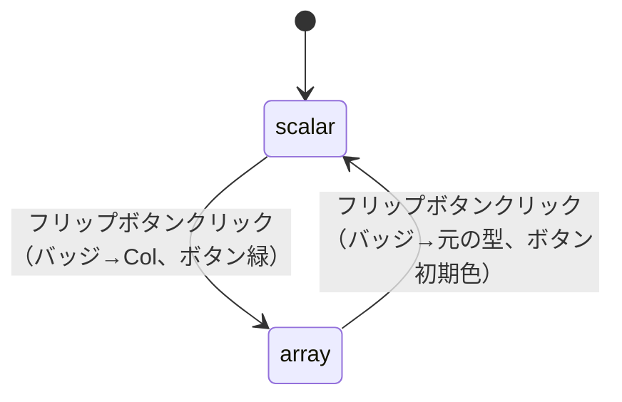

# 02 — Flowキャンバス仕様

対応モック: `docs/mockups/02-flow-canvas.html`

---

## 背景

- ベースカラー: `#111118`
- グリッド: ドット型、間隔 `24px`、ドット色 `rgba(255,255,255,0.07)`（背景よりちょい濃いめ）

---

## ズーム・パン

- ズーム・パン操作はReactFlowに委任（独自UIなし）
- 右上に「全体フィット」ボタン1個のみ配置（`32×32px`、角丸）

---

## Componentノード 共通仕様

### 構造
```
node-header   ← アイコン + タイトル
node-katex    ← = {KaTeX式}（Formulaのみ）
node-body     ← 左: inputポート列 | divider | 右: outputポート列
```

### カラーテーマ（Component種別ごと）

| Component | アクセントカラー |
|---|---|
| Formula | indigo `#6366f1` |
| Flow | teal `#14b8a6` |
| Const / Consts | amber `#f59e0b` |
| DatabaseTable | rose `#f43f5e` |
| DefaultInput | cyan `#06b6d4` |
| DefaultReturn | purple `#a855f7` |
| Map / Zip（Container） | bright indigo `#818cf8` |

アクセントカラーはheader背景・アイコン背景・node-nameテキストのみに適用。  
ポート・バッジ・エッジには適用しない。

### 型バッジ

- 全Component・全エッジで**緑統一**: `color: #4ade80`, `background: rgba(74,222,128,0.15)`
- Component種別カラーとは完全に分離（役割が違う）

### ポートレイアウト

- inputハンドル: ノード左端
- outputハンドル: ノード右端
- 各ポート行: `handle | [flip-btn] | type-badge | var-name`
- port-label（INPUT / OUTPUT）はポート列の上部に表示

### FormulaノードのKaTeX

- headerとbodyの間に`node-katex`エリアを挿入
- 表示形式: `= {式}`（左辺はタイトルに既にあるため省略）
- `data-katex`属性にLaTeX文字列を持たせる
- outputのvar-nameはFormulaのタイトルそのまま
- KaTeXシンボル（`katexSymbol`）のenable/disableは右上の「kaTeX」ボタンにより切り替え。表示中はkaTeXの文字を白く、非表示中は灰色にする。

### 選択状態

- クリックで選択: ノード外枠に `rgba(255,255,255,0.45)` のリングを表示
- キャンバスの空白クリックで選択解除

---

## エッジ

### 形状

- 三次ベジェ曲線（cubic bezier）
- 型バッジ部分（±10px）で線を分割して非表示にし、バッジが線と干渉しない

### 型バッジ（エッジ中点）

- 型一致: `type-badge`と同じ緑スタイル、型名のみ表示（例: `Col`）
- 型warn（int↔float numeric cast）: オレンジ `#f97316`、cast形式で表示（例: `F64→I32`）
- 型error: 赤 `#ef4444`、cast形式で表示、バッジを灰色化

### 型チェックルール（Phase 2時点のダミー）

```
同型         → ok（グレー）
numeric同士  → warn（オレンジ）: I32 / I64 / F32 / F64 間
それ以外     → error（赤）
```

> 型システムの本設計はPhase 5で行う。現時点のチェックはUIフィードバックの挙動確認用ダミー。

---

## ハンドルD&Dによるエッジ接続

### ドラッグ開始時（mousedown）

- ghostパス（白破線）が表示される
- キャンバス上の**全handleを走査**し、自分との型チェックを即座に実行
  - error: type-badge・var-nameを灰色化 + handleに`✕`をoverlay（handleのサイズ・レイアウトに影響しない）
  - warn: type-badge・var-nameをオレンジ化
  - ok: 変化なし
- フィードバック中はhover（黄緑拡大）を無効化（ok handleのみhover有効）

### ドラッグ終了時（mouseup）

- フィードバックを全リセット
- output→input（または逆）の組み合わせのみ接続を受け付ける
- 接続されたエッジは型チェック結果に応じた色で表示

---

## Map / ZipコンテナノードUI

### 構造

```
container-header  ← ⊞ Map: {formulaName}
container-body
  ports-col.inputs   ← formulaドロップ後に動的生成
  container-slot     ← formulaをドロップするエリア
  ports-col.outputs  ← formulaドロップ後に動的生成
```

### ドロップ前

- slotはdashed border（`rgba(129,140,248,0.35)`）
- `drop formula here` ヒントテキスト表示
- input/outputポートは空（非表示）

### formulaドロップ時

- containerのタイトルが `Map: {formulaName}` に自動更新
- slotにformulaが収まる（formulaのハンドルは非表示）
- formulaのinput/outputポートをcontainerが継承して動的生成

### inputポートのフリップボタン

- 各inputポート行に `handle | [flip-btn] | type-badge | var-name` の順で配置
- 初期状態: `to array`（スカラー）
- クリックで `to scalar`（配列）にトグル
  - array選択時: バッジが `Col` に変わり、ボタンが緑になる
  - scalar選択時: バッジが元の型に戻る

### outputの自動型決定

- inputが**全部scalar** → outputはformulaのoutput型そのまま
- inputに**1つでもarray** → output型は `Col`

---

## 未決・Phase 5以降

- 型表記: `Col[F64]` のような型パラメータ表現（型システム設計後に決定）
- 型チェックロジック: 本設計はPhase 5
- Map/Zipのaxis指定UI（複数inputのどれをarray軸にするか）
- slotからformulaを取り外す操作

---

## 削除操作

### ダブルクリック（常時）
- nodeをダブルクリック → 該当Componentのページをタブで開く（削除ではない）
- dynamic edgeのバッジをダブルクリック → そのedge削除

### Deleteモード
- 右上 `[Delete]` ボタンクリック → モードON（ボタンが赤くなる、カーソルが`not-allowed`）
- モード中の挙動:
  - nodeクリック → 削除、Shiftなし → 即モードOFF
  - nodeクリック → 削除、Shift押しっぱ → モード継続
  - dynamic edgeのバッジ/線クリック → 削除、同上
  - node/edge以外クリック → モードOFF
  - `[Delete]`ボタン再クリック → モードOFF

### edgeの当たり判定（現状と将来）
- 現状（モック）: 型バッジのみ当たり判定あり。edge線自体は細すぎて実用的でない
- 本実装（ReactFlow）: edge線の周辺数pxにも当たり判定をつける

---

## State Diagrams

### D-02-1: DeleteモードのON/OFF



### D-02-2: ハンドルD&D中のフィードバック状態



> 各handleのフィードバック状態（ok/warn/error）はドラッグ開始時に一括計算し、mouseupで全リセットする。

### D-02-3: Map/ZipコンテナのSlot状態



> `empty` 時はslotに `drop formula here` ヒントを表示。`occupied` 時はslotにformulaが収まりinput/outputポートが動的生成される。

### D-02-4: inputポートのフリップ状態



> フリップ状態はポートごとに独立。全portがscalar → outputはformula本来の型。1つでもarray → outputは `Col`。

---

## 将来実装（Phase 6）

- 選択中Componentに`Ctrl+C / Ctrl+V / Delete key`
- 範囲選択→複数Component一括操作（ドラッグで矩形選択）
- 範囲選択内のedgeのみcopy+paste反映
  - 範囲外Componentへのedgeはpaste時に消える

### formulaの分離

- slotにはめたformulaノードをドラッグしてコンテナ枠外にドロップ → slotから分離、通常のキャンバスノードに戻る
- 分離時: containerのinput/outputを消去、タイトルを`Map`に戻す、slotを空状態（`drop formula here`）に戻す