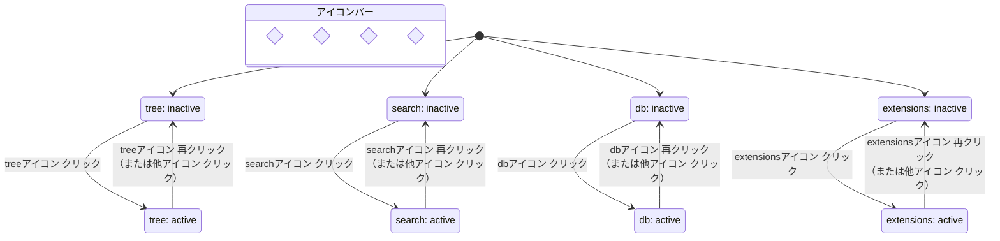
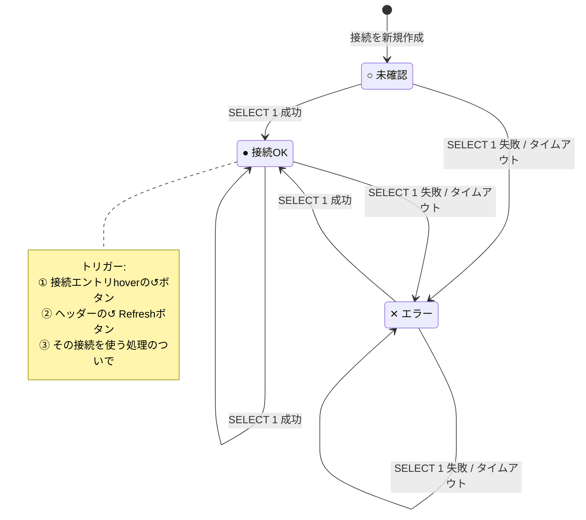
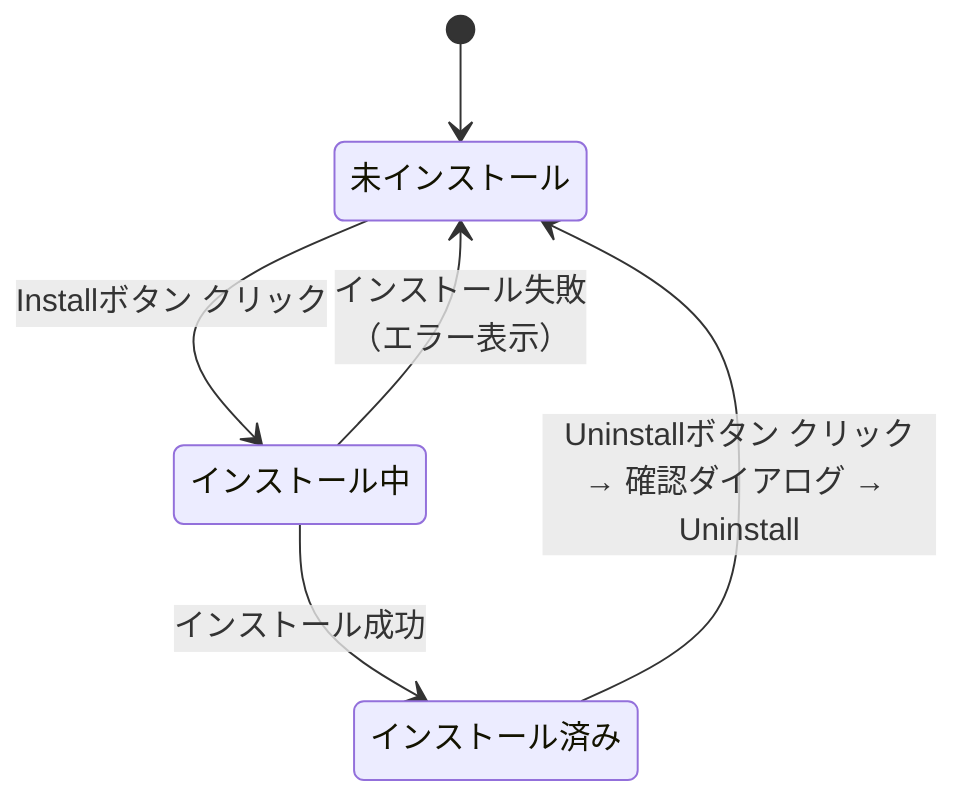
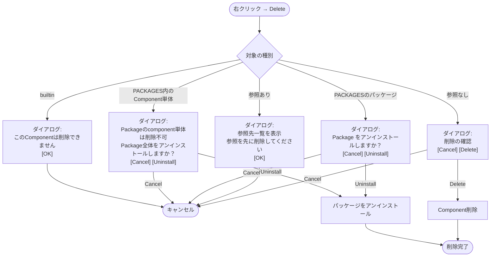
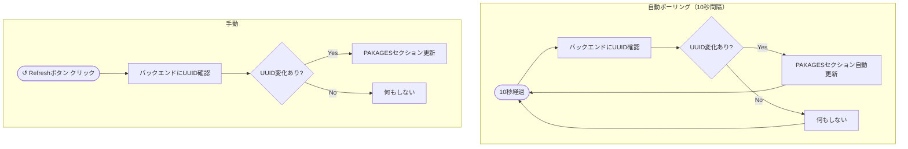

# 04 — 左端アイコンバー＋サイドパネル仕様

対応モック:
- `docs/mockups/04-sidebar/04a-sidebar-tree.html`    — アイコンバー + Componentツリーパネル
- `docs/mockups/04-sidebar/04b-sidebar-search.html`  — 検索パネル
- `docs/mockups/04-sidebar/04c-sidebar-db.html`      — DB接続パネル
- `docs/mockups/04-sidebar/04d-sidebar-contrib.html` — Contribパネル

---

## 左端アイコンバー

- 幅: 固定 `48px`
- VSCodeのアクティビティバーに準拠
- 常に表示（パネルを閉じても消えない）

### 領域構成

アイコンバーは**上側（機能系）**と**下側（設定系）**の2領域に分かれる。
将来のcontrib・ACL追加に備え、両領域は独立してアイコンを追加できる。

```
┌────┐
│ ⊟  │ ← 機能系（上側）: 組み込み + contrib追加分
│ ⌕  │
│ DB │
│ ⬡  │ ← Extensions (Contrib)
│    │
├────┤
│ 👤 │ ← 設定系（下側）: 将来追加
│ ⚙  │ ← 常に最下端固定
└────┘
```

### 機能系アイコン（上側）

| アイコン | 内容 |
|---|---|
| ⊟ | Componentツリー |
| ⌕ | 検索 |
| DB | DB接続管理 |
| ⬡ | Extensions（Contrib） |

- クリックでサイドパネルを開く（同アイコン再クリックでトグル閉じ）
- アクティブなアイコンは左端に `2px` のアクセントカラーバーを表示
- contribインストールでアイコンが追加される（将来）

### 設定系アイコン（下側）

| アイコン | 内容 |
|---|---|
| 👤 | ユーザー（将来: ACL対応時に追加） |
| ⚙ | 設定（常に最下端固定） |

- クリックでサイドパネルは**開かず**、アイコン付近にメニューポップアップを表示
- 項目クリックで別ページをタブで開く

#### ユーザーメニュー（将来）
- Profile
- Sign Out

#### 設定メニュー
- Settings（`/settings`）
  - Keyboard Shortcuts・ThemeはSettings内に収める

---

## サイドパネル 共通仕様

- デフォルト幅: `240px`
- 右端ドラッグでリサイズ可（最小 `160px`、最大 `480px`）
- アイコンバーのトグルで幅 `0` にアニメーション収納（`transition: width 0.18s`）
- パネルはメインエリアを**押し広げる**（オーバーレイではない）

---

## Componentツリーパネル

### セクション構成

パネルはVSCodeのExplorerと同様に複数セクションで構成される。

```
COMPONENT TREE    ← ユーザー定義・builtin
PACKAGES          ← contribインストール済みパッケージ（デフォルト折りたたみ）
```

各セクションはヘッダークリックで折りたたみ可能。

---

### COMPONENT TREE セクション

```
COMPONENT TREE  [+] [📁] [↺]    ← ヘッダーhover時に表示
  ▼ builtin
    ▶ math
    ▶ sql
  ▼ user
    ▼ flows
      ⇢ GetIVChar            ●
      ⇢ CalcTransistorGain
    ▼ formulas
      fx CalcGainBandwidth
      fx FilterIV             ●
      fx OldCalc                  ← 孤立Component（名前を灰色表示）
    ▼ dbtables
      DB transistor_iv_table
    ▶ consts
```

#### エントリの状態表示

| 状態 | 表示 |
|---|---|
| 未保存（draft） | エントリ右端に `●` |
| 孤立Component（どこからも参照されていない） | 名前を灰色表示 |

#### 操作
- ダブルクリック: 該当Componentのページをタブで開く

#### ヘッダーhoverボタン

| ボタン | 動作 |
|---|---|
| `+` | New Component... → 種別選択ダイアログ |
| `📁` | New Folder |
| `↺` | Refresh |

#### 右クリックメニュー（フォルダ）

| 項目 | 動作 |
|---|---|
| New Component... | 種別選択ダイアログ → そのフォルダ配下に作成 |
| New Folder | サブフォルダ作成 |
| Rename | インライン編集 |
| Delete | 削除（後述の削除ルール参照） |

#### 右クリックメニュー（Componentエントリ）

| 項目 | 動作 |
|---|---|
| Rename | インライン編集 |
| Delete | 削除（後述の削除ルール参照） |

#### New Component 種別選択ダイアログ

選択肢:
- Formula
- Flow
- Const
- Consts
- DatabaseTable
- DefaultInput

---

### 削除ルール

Component・フォルダの削除時は以下のルールに従う。

#### 参照なし
確認ダイアログを表示し、OK後に削除。

```
削除の確認
{ComponentName} を削除しますか？この操作は取り消せません。
[Cancel] [Delete]
```

#### 参照あり（Flow含む）
FlowもFlowから参照されうるため、Flow・Formula・DatabaseTable等すべてのComponentが対象。

```
削除できません
{ComponentName} は下記のComponentで参照されています。
  · {ComponentName A}
  · {ComponentName B}
参照を削除してから削除してください。
[OK]
```

#### builtin
```
削除できません
このComponentは削除できません。
[OK]
```

#### PAKAGESのComponent単体
```
Packageのアンインストール
Packageのcomponent単体を削除することはできません。
Package "{package名}" をアンインストールしますか？
[Cancel] [Uninstall]
```

#### PAKAGESのPackage
```
Packageのアンインストール
Package "{package名}" をアンインストールしますか？
[Cancel] [Uninstall]
```

---

### PACKAGES セクション

contribとしてインストールされたパッケージを表示。**読み取り専用**。
デフォルトは折りたたみ状態。

```
PACKAGES  [↺]    ← ヘッダーhover時に表示
  ▶ transistor-analysis@1.2.0
  ▶ signal-processing@0.8.1
```

- パッケージ名＋バージョンをトップレベルディレクトリとして列挙
- 展開するとCOMPONENT TREEと同じ構造でcompoが並ぶ
- 編集・削除不可（右クリックしてもComponent単体削除ダイアログのみ表示）
- 中のcompoはキャンバスから参照可能（builtinと同じ扱い）

#### 更新の仕組み

- バックエンドはパッケージ更新のたびにUUID（etagに相当）を発行
- UIは10秒ごとにUUIDを確認 → 変わっていたら自動更新
- `↺` Refreshボタン: 手動で即時確認

---

## 検索パネル

VSCodeの検索パネルに準拠。

### 検索入力

- プレースホルダー: `Component名・式・変数名で検索`
- 入力クリアボタン（`✕`）: 入力があるときのみ表示
- リアルタイム検索（入力のたびに結果更新）

### 検索対象フィールド

各Componentが持つ全フィールドをJSONとしてインデックス。

| Component | 検索対象フィールド |
|---|---|
| Formula | 名前・式・引数名・概要 |
| Flow | 名前・概要 |
| Const / Consts | 名前・値・概要 |
| DatabaseTable | 名前・テーブル名・列名・概要 |
| DefaultInput | 名前・引数名・概要 |

### 検索結果の表示形式

```
"{query}" — {件数} 件

CalcGainBandwidth              formula
  引数: ivChar, vBias
  式:   ivChar + vBias / gain
  参照元: GetIVChar  CalcTransistorGain

FilterIV                       formula
  式: WHERE ivChar > 0 AND vgs < threshold
  参照元: GetIVChar
```

- ヒット箇所を黄色ハイライト表示
- `参照元` の各リンクはクリックで該当FlowをタブでOpen
- 結果はcompo単位（同一compoが複数flowから参照されていても重複しない）

### 空状態

| 状態 | 表示 |
|---|---|
| 未入力 | `⌕` アイコン + `検索ワードを入力してください` |
| ヒットなし | `🔍` アイコン + `該当するComponentが見つかりませんでした` |

### 将来対応（注記）

- AST類似度検索: `a+b/c` のような式構造で検索
- スコアリング: 変数名マッチ量で順位付け

---

## DB接続パネル

### 対応DB

- **PostgreSQL**（当面はこれのみ）
- Snowflake: DuckDB公式コネクタが現状存在しないため非対応。将来的にwrapper実装を検討

### パネル表示

```
DB CONNECTIONS  [+] [📁] [↺]    ← ヘッダーhover時に表示
  ▼ production
    ● transistor_db    (last 2 min)
    ○ iv_archive       (last 42 min)
  ▼ staging
    ● test_db          (last 8 min)
    ✕ broken_db        (last 1 min)
```

- フォルダ名は任意（ユーザーが自由に命名）

### 接続ステータス

| 記号 | 色 | 意味 |
|---|---|---|
| `●` | 緑 | 接続OK |
| `○` | 灰 | 未確認・長時間未更新 |
| `✕` | 赤 | エラー |

- ステータスの右に最終確認時刻を `(last x min)` 形式で表示
- hover時: 時刻表示が消え、編集（✏）・ステータス確認（↺）ボタンが出る

### ステータス更新タイミング

- **手動**: 接続エントリhoverの `↺` ボタン or ヘッダーの `↺` Refreshボタン → 即時確認
- **自動**: その接続を使う処理（クエリ実行等）のついでに更新
- 常時ポーリングは行わない

#### 生存確認の仕組み

バックエンド（Go）が対象DBに `SELECT 1` を投げて応答確認。結果をAPIで返す。

### 接続設定

- エントリhover時に編集アイコン（✏）を表示
- クリックで接続設定ページをタブで開く（`/dbconnections/:id`）
- 設定内容: 接続名・ホスト・ポート・DB名・ユーザー・パスワード等（PostgreSQL ATTACH用パラメータ）

### ヘッダーhoverボタン

| ボタン | 動作 |
|---|---|
| `+` | 新規接続 → 接続設定ページをタブで開く |
| `📁` | 新規フォルダ |
| `↺` | 全接続のステータスを即時確認 |

### 右クリックメニュー（フォルダ）

| 項目 | 動作 |
|---|---|
| New Connection | 接続設定ページをタブで開く |
| New Folder | サブフォルダ作成 |
| Rename | インライン編集 |
| Delete | 確認ダイアログ後に削除 |

### 右クリックメニュー（接続エントリ）

| 項目 | 動作 |
|---|---|
| Edit | 接続設定ページをタブで開く |
| Check Status | 即時ステータス確認 |
| Delete | 確認ダイアログ後に削除 |

---

## Contribパネル（Extensions）

VSCodeの拡張機能マーケットプレイスに準拠。
インストールしたパッケージはCOMPONENT TREEのPACKAGESセクションに反映される。

### 検索入力

- プレースホルダー: `Packagesを検索...`
- リアルタイムフィルタリング（名前・説明・タグ対象）

### セクション

| セクション | 内容 |
|---|---|
| マーケットプレイス | 全パッケージ一覧（インストール済み含む） |
| インストール済み | インストール済みのみ絞り込み |

### パッケージカード

```
┌─────────────────────────────────────────────┐
│ [icon]  package-name                        │
│         v1.2.0 · author                     │
│                                             │
│  パッケージの説明テキスト（2行まで表示）      │
│                                             │
│  [tag] [tag]          [Install / ✓ Installed] │
└─────────────────────────────────────────────┘
```

- アイコン: パッケージ種別に応じた色付きアイコン（32×32px、角丸）
- hover時: `✓ Installed` ボタンが非表示になり `Uninstall` ボタンが出る

### インストール状態

| 状態 | ボタン表示 | 色 |
|---|---|---|
| 未インストール | `Install` | indigo |
| インストール中 | `Installing...`（disabled） | amber |
| インストール済み | `✓ Installed` / hover時 `Uninstall` | green / red |

### アンインストールダイアログ

```
Packageのアンインストール
Package "{package名}" をアンインストールしますか？
[Cancel] [Uninstall]
```

### 空状態（検索ヒットなし）

```
📦
該当するPackageが見つかりませんでした
```

---

## State Diagrams / Flowcharts

### D-04-1: アイコンバーのアクティブ状態

各アイコン（tree / search / db / extensions）は独立してactive/inactiveをトグルする。
同アイコン再クリックでパネルを閉じ（inactive）、別アイコンクリックで別パネルへ切り替わる（前のアイコンはinactive）。



> 注: 複数アイコンが同時にactiveになることはない（1つがactiveになると他はinactiveに戻る）。

---

### D-04-2: DB接続ステータス

各DB接続エントリは `○`（未確認）・`●`（接続OK）・`✕`（エラー）の3状態を持つ。
ステータスの更新は手動または処理トリガーのみ（常時ポーリングなし）。



---

### D-04-3: contribパッケージのインストール状態



> `installing` 中はボタンが `Installing...`（disabled）になる。<br/>
> アンインストール時はPACKAGESセクションからも該当パッケージが消える。

---

### D-04-4: Component削除フロー

削除対象の種別によってダイアログ分岐が異なる。



---

### D-04-5: PAKAGESセクションの更新フロー

バックエンドがパッケージ更新のたびにUUIDを発行。UIは10秒ポーリングでUUIDを監視し、変化があれば自動更新する。手動↺は即時確認。

