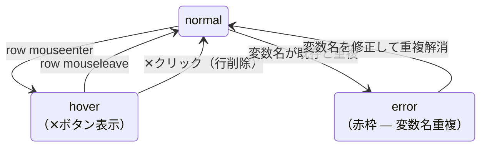

# 06a — 引数（INPUTS）仕様

---

## 引数（INPUTS）

| 要素 | 仕様 |
|---|---|
| 変数名 | 自由入力。重複不可。KaTeXに影響する文字（`\`, `{`, `}`, `^`, `_`等）は不可 |
| 型 | デフォルト `F64`。`▼` プルダウンで変更。選択肢はPhase 5で確定（TBD） |
| 削除 | row hover時に変数名右端に `✕` ボタン表示 |
| 並び替え | D&Dで並び替え可。順番がFlowキャンバスのport順に反映される |
| 追加 | リスト下の `[+]` ボタン。追加時は変数名空・型 `F64` で行追加 |

変数名の重複チェックはリアルタイム。重複時はその行の変数名に赤枠表示。

---

## State Diagrams

### D-06-4: 引数（INPUTS）行の状態

