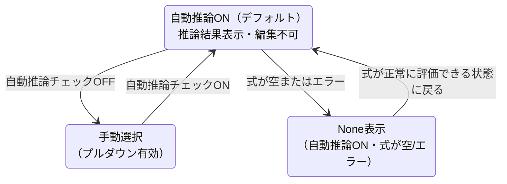
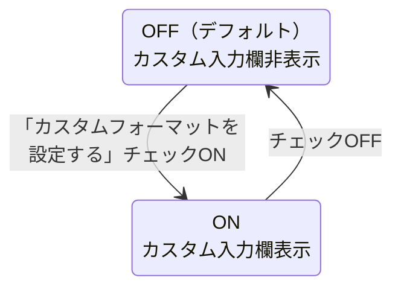

# 06b — 式エリア・出力型・KaTeX仕様

---

## 式エリア（FORMULA）

- 1行テキスト入力（式が長くなる場合は折り返し表示）
- リアルタイムバリデーション
- 変数名の色分け:
  - 引数（INPUTS）に定義済みの変数名 → 青ハイライト
  - 未定義の変数名 → 白字 + 赤波線
- エラーメッセージ: 式エリアの直下に表示
- 確定タイミング: フォーカスアウト / Enter

---

## 出力型

- デフォルト: 「自動推論」チェックON → 推論結果を表示（編集不可）
- チェックOFF → プルダウンで手動選択。選択肢はPhase 5で確定（TBD）
- 推論できない場合（式が空・エラー等）は `None` を表示

---

## KaTeXプレビュー

- 式エリアの変更に連動してリアルタイム更新
- 引数の変数名をそのまま使ったデフォルト表示
- カスタムフォーマットが有効な場合はそちらを優先

---

## KaTeXフォーマット（オプション）

- 「カスタムフォーマットを設定する」チェックボックス。デフォルトOFF
- チェックONで入力欄を表示（式エリアと同サイズ）
- LaTeX記法で記述。例: `ivChar + \frac{vBias}{gain}`
- 変数名の色分け（式エリアと同じルール）:
  - 引数に定義済みの変数名 → 青ハイライト
  - 未定義の変数名 → 白字 + 赤波線
- 引数の変数名が変更された場合: 内部IDで追跡し自動置換
- KaTeXプレビューにリアルタイム反映

---

## State Diagrams

### D-06-5: 出力型の自動推論状態

### D-06-6: KaTeXフォーマットのON/OFF

