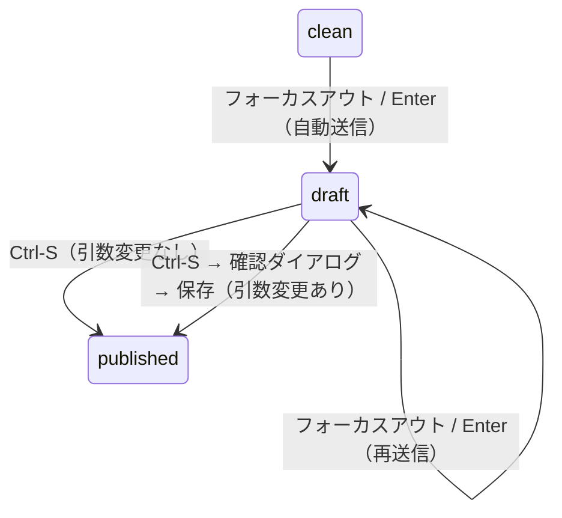
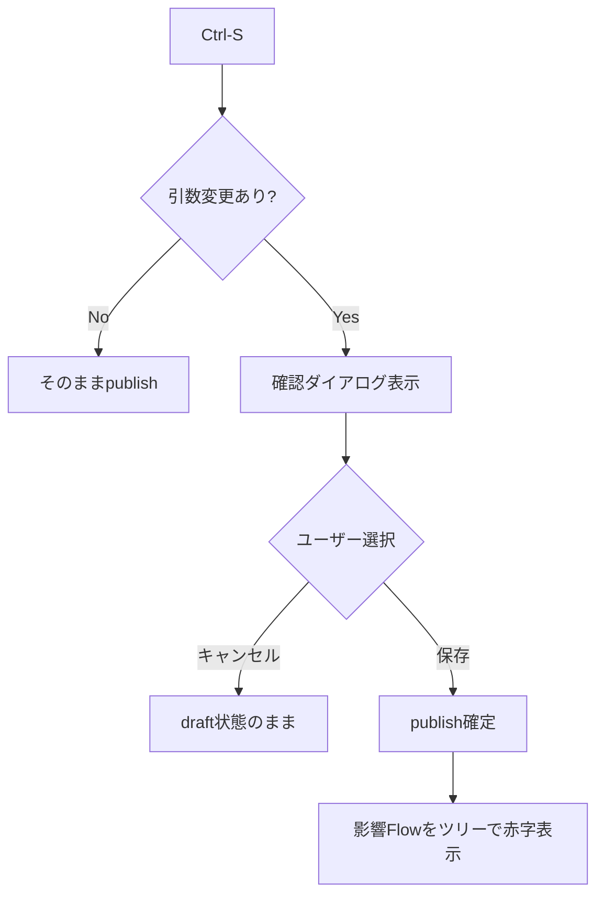

# 06c — 保存仕様

---

## 保存（draft / published）

- 式・引数・概要・タイトルの変更 → フォーカスアウト/Enterのタイミングでdraft自動送信
- Ctrl-S → publish確定
- **引数の追加・削除・型変更があった場合**: publish時に確認ダイアログを表示

```
保存の確認
以下のComponentに不整合が生じます:
  · GetIVChar
  · CalcTransistorGain
保存してよろしいですか？
[キャンセル]  [保存]
```

- 保存後、不整合が生じたFlowはツリー上でタイトルを赤字表示

---

## State Diagrams

### D-06-1: Formula全体の保存状態



### D-06-2: publish時のダイアログ分岐（引数変更あり）


