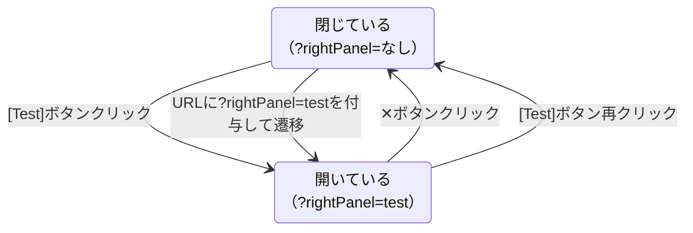

# 06d — Testパネル仕様

---

## Testパネル（右パネル）

ヘッダー右端の `[Test]` ボタンクリックで `?rightPanel=test` がトグル。右からスライドして出る（01-layout.mdの右パネル仕様に準拠）。

DefaultInputの `[テストタブ]`（`docs/spec/09-default-input.md`）と同構造。引数の変数名・型をFormulaの定義から引く。

- テストケース一覧・値の設定・実行
- pass / fail 表示
- 実行エンドポイント: `POST /formulas/:id/run`（FlowのAPIと同形式）

---

## State Diagrams

### D-06-3: Testパネルのトグル

