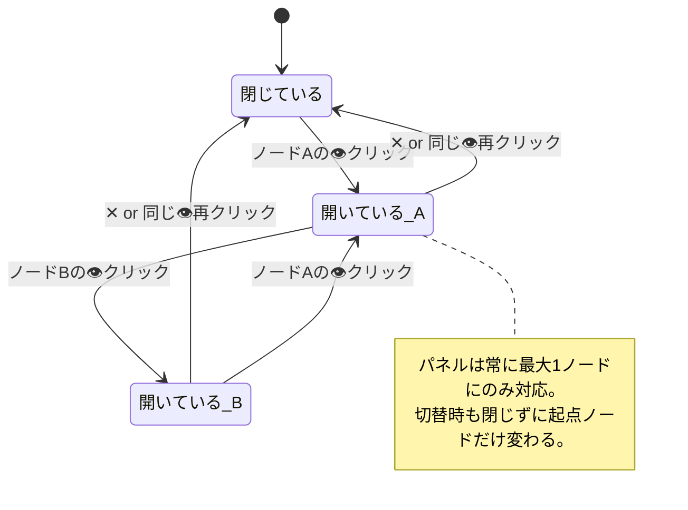
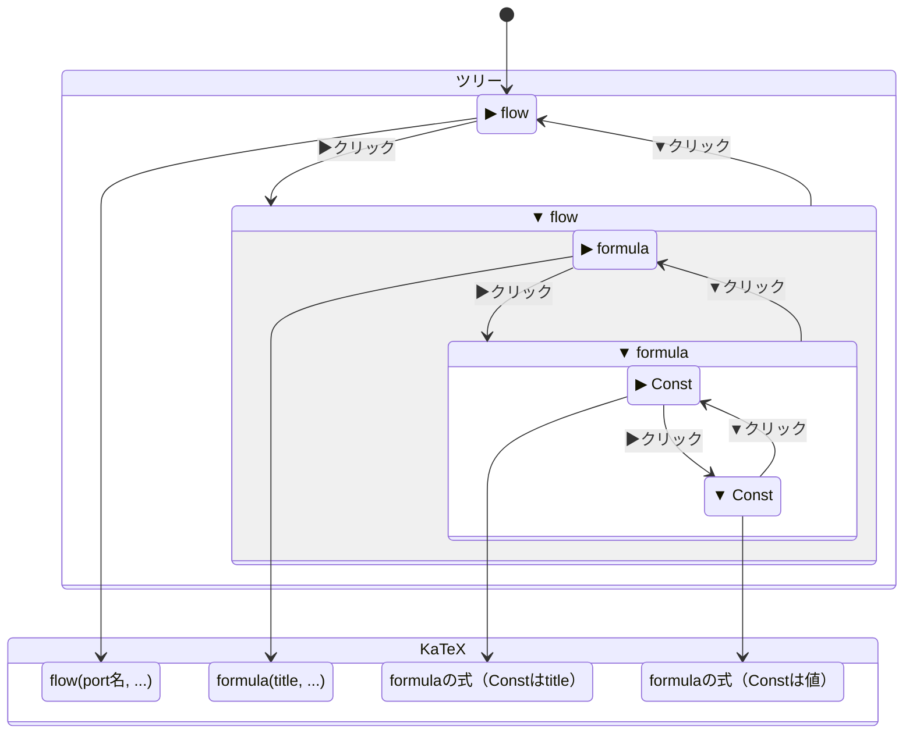
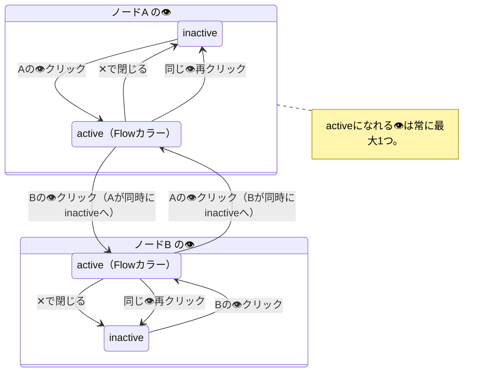

# 07 — Formula Inspectパネル仕様

対応モック: `docs/mockups/07-formula-inspect/`
- `07a-inspect-panel-open.html` — パネル開閉・スライドイン
- `07b-inspect-tree-katex.html` — Tree展開 + KaTeX連動（全4段階）
- `07c-inspect-multi-return.html` — DefaultReturn複数のselectbox切り替え（未作成）
- `07d-inspect-flow-nest.html` — FlowComponentネスト展開（未作成）

---

## 概要

Flowキャンバス上のノードに表示される👁ボタンをクリックすることで、
右パネルとしてInspectパネルが開く。

パネルはツリーUIとKaTeXエリアの2ペイン構成で、
ツリーを展開するにつれてKaTeX式が段階的に詳細化される。
これにより、ノードが多くなって見づらいFlowでも、
式の全容を即座かつ数式として把握できる。

---

## 表示コンテキスト

| 項目 | 値 |
|---|---|
| 対象ページ | `/flows/:id` のみ |
| URLパラメータ | `?rightPanel=inspect` |
| 発火イベント | キャンバス上ノードの👁ボタンクリック |
| パネル幅 | 280px（デフォルト）、左端ドラッグでリサイズ可 |
| 表示方式 | メインエリアを押し広げる（オーバーレイではない） |
| 閉じる | パネル右上の✕ボタン、または同じ👁ボタンを再クリック |

---

## パネル構成

```
┌─────────────────────────┐
│ INSPECT              ✕  │  ← ヘッダー
├─────────────────────────┤
│ OUTPUT                  │
│ [Id              ▾]     │  ← DefaultReturn selectbox（常時表示）
├─────────────────────────┤
│                         │
│   KaTeXエリア            │  ← ツリー状態に連動して更新
│                         │
├─────────────────────────┤
│ ▶ ⇢ transistor_iv_flow  │
│   ▶ fx calc_drain_cu... │  ← Treeエリア（展開可）
│   ...                   │
└─────────────────────────┘
```

---

## DefaultReturn selectbox

- DefaultReturnのinputポートを選択肢として列挙する
- 1つのみでも常にselectboxを表示する（条件分岐なし）
- 選択を切り替えるとツリーおよびKaTeXが切り替わる

---

## ツリー表示ルール

### ツリーのroot

表示中のFlowがrootになる。

### 展開可能なノード

展開すると **arg名行** → **compo行** の2段構造で子が出現する。

| ノード種別 | 表示 | 展開したとき |
|---|---|---|
| FlowComponent | title | 中身のFlowのarg名行 + compo行が出現（再帰） |
| FormulaComponent | title | formulaの各input portのarg名行 + 繋がるcompo行が出現 |
| Const | title | 値（スカラー）が子として出現 |
| Consts | `{title}({key})` | 値が子として出現 |

### 子ノードの2段構造

FormulaComponent / FlowComponentを展開したとき、子は以下の2行セットで表示される：

```
[indent] [arg名]                   ← arg名行（chevronなし・アイコンなし・明るめ灰色・小さめ文字）
[indent+1] [▶/▼] [icon] [compo名] ← compo行（通常のツリー行）
```

- **arg名行**: chevronなし・アイコンなし・インデントは親と同じ・色 `#aaaabc`・文字サイズ小さめ（10px）
- **未接続arg**: arg名行のみ表示。compo行は出現しない
- **compo行**: 通常のコンポーネント行（chevron・アイコン・name・↗ボタン）

### 末端（展開不可）

| ノード種別 | 表示 |
|---|---|
| DefaultInputのport | port名（変数名） |
| Constの値 | 値そのもの（数値・文字列） |
| Constsの値 | 値そのもの |

### 各行の構成

**compo行:**
```
[indent] [▶/▼ or 空白] [componentアイコン] [name]  | ↗
```

**arg名行:**
```
[indent] [arg名]   ← chevronなし・アイコンなし
```

- **chevron**（▶/▼）: compo行のみ。展開可能なら表示、末端は空白
- **componentアイコン**: `03-component-nodes.md` のカラーテーマに準拠
- **`| ↗` アクションボタン**: compo行のhover時に出現。縦線区切りの右に↗ボタン、クリックでそのcomponentの編集ページへ遷移
- **インデント**: 階層ごとに16px増加

---

## KaTeX連動ルール

ツリーの展開状態とKaTeX表示は1:1で対応する。

### 変数名の解決ルール（汎用）

KaTeX上の変数名は以下のルールで決まる：

- **DefaultInput port** に繋がっている → そのport名が変数名
- **Const / Consts** に繋がっている → そのtitleが変数名（展開すれば値に置換）
- **FlowComponent** に繋がっている → 展開前はtitle、展開後は内部Flowの式に置換
- **未接続arg** → FormulaのそのargのID/名前を変数名として使用（KaTeX上で暗め表示）

要約: **上流componentのtitleまたはport名が、繋がっているargの変数名としてKaTeXに伝搬する。**

### ツリー状態 × KaTeX表示の対応表

| ツリー状態 | KaTeX表示 |
|---|---|
| `▶ flow` | `flow(DefaultInputのport名, ...)` |
| `▼ flow / ▶ formula` | `formula(各argに繋がるcompoのtitle or port名, ...)` |
| `▼ flow / ▼ formula / ▶ Const` | formulaの式（Constはtitle） |
| `▼ flow / ▼ formula / ▼ Const` | formulaの式（Constは値） |
| `▼ flow / ▶ bias_flow` | `bias_flow(内部FlowのDefaultInputのport名, ...)` |
| `▼ flow / ▼ bias_flow / ▶ formula` | `formula(各argに繋がるcompoのtitle or port名, ...)` |
| `▼ flow / ▼ bias_flow / ▼ formula / ▼ Const` | formulaの式（Constは値に展開） |

**表示ルール詳細:**

- 未展開ノード → そのノードの **title** で表現
- FormulaComponent展開 → そのFormulaの **式** （KaTeX）を使用
- Const展開 → title から **値** に置換
- DefaultInputのport → **port名**（末端、変数として表現）
- FlowComponent → 展開前はtitle、展開後は内部Flowの展開されたKaTeX式に置換
- 未接続arg → **arg名**（暗め表示）

**カラーリング（`\textcolor` で色付け）:**

| 種別 | カラー |
|---|---|
| FlowComponent | `#5eead4` |
| FormulaComponent | `#a5b4fc` |
| Const / Consts | `#fcd34d` |
| DefaultInputのport名 | `#67e8f9` |

---

## 👁ボタンの仕様

- Flowキャンバス上の各ノードのheaderに表示
- クリックでInspectパネルを開き、そのノードを起点としたInspectを開始する
- アクティブ状態（パネル開中）はボタンをハイライト表示（Flowカラー `#5eead4`）
- 別ノードの👁をクリックすると切り替わる
- パネルを✕で閉じると👁のハイライトも解除される

---

## FlowComponentのネスト展開

FlowComponent（`⇢` アイコン）はツリー上で展開可能。
展開するとその参照先FlowのDefaultReturnを起点とした
サブツリーが展開される（再帰的に潜れる）。

KaTeXもそれに連動して、FlowComponentのtitleが
内部Flowの展開されたKaTeX式に置換される。

FlowComponentを展開した直後のKaTeX表示は
`bias_flow(内部FlowのDefaultInputのport名, ...)` の形になる。
つまり展開時点で内部FlowのDefaultInputのport名が引数名として使われる。

---

## State Diagrams

### D-07-1: Inspectパネルの開閉



### D-07-2: ツリーノードの展開状態 × KaTeX連動



### D-07-3: 👁ボタンのハイライト状態


