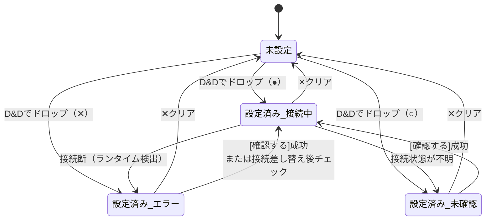
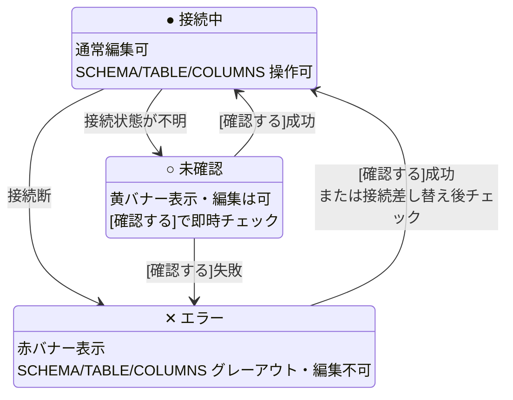
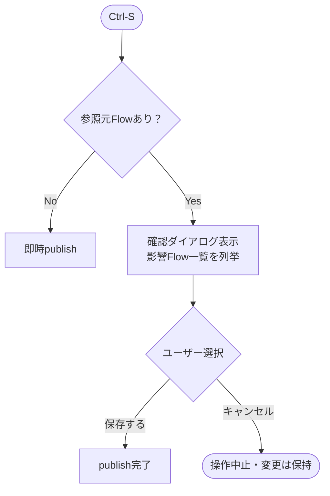
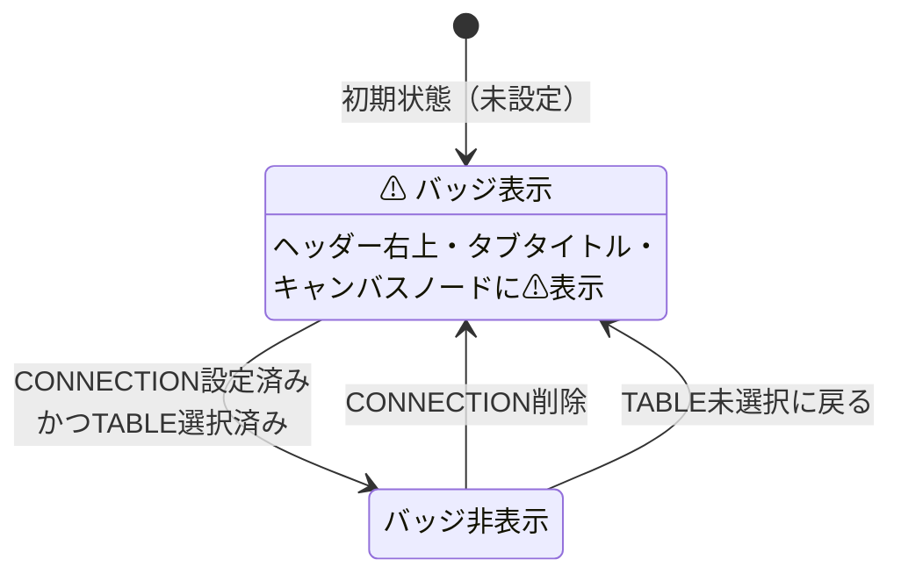

# 08 — DatabaseTable設定ページ仕様

対応モック: `docs/mockups/08-dbtable-editor/`（未作成）

---

## 概要

`/dbtables/:id` で開く DatabaseTableComponent の設定ページ。
DB接続・schema・tableを指定することで、キャンバス上のノードに列ごとのoutputハンドルが生成される。

タブ構成はなし（単一ページ）。

---

## ページ構造

```
┌─────────────────────────────────────────────────────────┐
│  DB  transistor_iv_table         /dbtables/...   [⚠]   │  ← ヘッダー（未設定時は⚠）
│      トランジスタのIV特性テーブル                        │  ← 概要（任意入力）
├─────────────────────────────────────────────────────────┤
│  ⚠ このテーブルを参照しているFlowに影響があります        │  ← 変更時警告バナー（変更時のみ）
├─────────────────────────────────────────────────────────┤
│  TITLE                                                   │
│  [transistor_iv_table________________]                   │
│                                                          │
│  CONNECTION                                              │
│  ┌─────────────────────────────────────────────┐        │
│  │  ここにDB接続をドラッグ＆ドロップ            │        │
│  │  ● transistor_db  (production)              │  ← 設定済み状態
│  └─────────────────────────────────────────────┘        │
│                                                          │
│  SCHEMA                                                  │
│  [public ▼]                                             │
│                                                          │
│  TABLE                                                   │
│  [🔍 テーブルを検索...]                                  │
│  ┌─────────────────────────────────────────────┐        │
│  │  transistor_iv_data             ← 選択中    │        │
│  │  transistor_params                           │        │
│  │  gain_curves                                 │        │
│  └─────────────────────────────────────────────┘        │
│                                                          │
│  COLUMNS                                                 │
│  ┌──────────────────┬──────────────┬───────────┐        │
│  │ 列名             │ formuflow型  │ DB型      │        │
│  ├──────────────────┼──────────────┼───────────┤        │
│  │ transistor_id    │ Str          │ varchar   │        │
│  │ vgs              │ F64          │ float8    │        │
│  │ vds              │ F64          │ float8    │        │
│  │ ids              │ F64          │ float8    │        │
│  └──────────────────┴──────────────┴───────────┘        │
└─────────────────────────────────────────────────────────┘
```

---

## 各セクション仕様

### TITLE

- デフォルト値: 選択したtable名
- ユーザーが任意で上書き可能
- ここで設定した名前がComponentツリーおよびキャンバスノードの表示名になる

### CONNECTION（D&Dエリア）

- サイドバーのDB接続パネルのエントリをここにドロップすることで接続を設定
- 設定済みの場合は接続名・フォルダ名・ステータスバッジを表示
- 接続を変更する場合は別のエントリを再度ドロップ（上書き）
- ✕ボタンで接続をクリア（未設定状態に戻す）

#### 接続ステータス別の挙動

| ステータス | D&D受付 | 挙動 |
|---|---|---|
| `●` 接続中 | ✅ | 通常動作。schema/tableリストを取得する |
| `○` 未確認 | ✅ | 警告バナー表示（黄）。「接続状態が未確認です。[確認する]」。[確認する]クリックで即時チェック。成功すれば通常動作 |
| `✕` エラー | ✅ | 警告バナー表示（赤）。「接続エラーです。サイドバーから接続を確認してください」。SCHEMA・TABLE・COLUMNSセクションはグレーアウト・編集不可 |

- D&Dは `✕` 状態でも受け付ける（ユーザーが接続を差し替えたい場合があるため）
- `✕` 状態でSCHEMA以下が編集不可になるが、既存のtable名・列設定は保持する（接続が復活したとき自動回復）

### SCHEMA

- CONNECTION設定後、そのDBのschema一覧をfetchしてselectboxに表示
- PostgreSQLの場合 `public` など複数schemaが存在しうる
- 将来的にSnowflake等が追加されても同じUIで対応可能

### TABLE

- SCHEMA選択後、そのschema内のテーブル一覧をfetchしてリスト表示
- リスト上部にインクリメンタルサーチ入力欄を設置（入力した文字列でテーブル名をフィルタリング）
- リストの各行をクリックして選択。選択中の行をハイライト表示

### COLUMNS

- TABLE選択後、そのテーブルの列情報をfetchして表示
- **read-only**。ユーザーによる編集不可
- 表示カラム: 列名 / formuflow型 / DB型（元のDB型を参考表示）
- formuflow型はDuckDB型マッピングに基づいて変換して表示（型一覧はPhase 5で確定）
- この列一覧がキャンバス上のノードのoutputハンドル（Ref型）に対応する

---

## 未設定状態のwarningバッジ

- CONNECTION未設定 または TABLE未選択 の場合、ヘッダー右上に `⚠` バッジを表示
- バッジはページタブのタイトル右にも表示（他のタブから視認できるように）
- キャンバス上の DatabaseTableComponent ノードにも警告バッジを表示（`03-component-nodes.md` 参照）

---

## 参照元バーと保存フロー

### 参照元バー

このDatabaseTableを参照しているFlowが存在する場合、ヘッダー直下に参照元バーを常時表示する。

```
このテーブルは [⇢ GetIVCharByTransistorId] [⇢ CalcGainFlow] で使用されています
```

- 各リンクをクリックすると該当Flowをタブで開く
- 参照元がない場合は表示しない

### 保存フロー（Ctrl-S）

1. 参照元バーが**表示されていない**場合 → そのままpublish
2. 参照元バーが**表示されている**場合 → 確認ダイアログを表示

```
┌─────────────────────────────────────────────┐
│  テーブル設定を変更します                    │
│                                             │
│  以下のFlowが影響を受けます：               │
│    • GetIVCharByTransistorId                │
│    • CalcGainFlow                           │
│                                             │
│  列の変更により、既存のエッジ接続が          │
│  無効になる可能性があります。               │
│                                             │
│         [キャンセル]  [保存する]            │
└─────────────────────────────────────────────┘
```

3. 「保存する」を選択 → publish完了。影響FlowをComponentツリーで赤字表示

### draft自動保存

- 設定変更のたびにdraftとして自動保存（バックエンドへ自動投げ）
- タブタイトル左・Componentツリーエントリ右端に `●` を表示（未保存インジケータ）

---

## ページ遷移（タブで開く起点）

| 起点 | 操作 |
|---|---|
| Componentツリー | DatabaseTableエントリをダブルクリック |
| キャンバス | DatabaseTableComponentノードをダブルクリック |

どちらの場合もメインエリアのタブとして開く（`05-tabs-navigation.md` の共通ルールに従う）。

---

## State Diagrams

### D-08-1: 接続設定の状態



---

### D-08-2: 接続ステータス別の編集可否



---

### D-08-3: publish時のフロー

> 注意: publish後の「影響ComponentをComponentツリーで✕/⚠表示」はサイドバーの責務であり、
> ここには含めない。サイドバーのValidation状態管理は `04-sidebar.md` に別途定義する。



---

### D-08-4: warningバッジの表示条件


