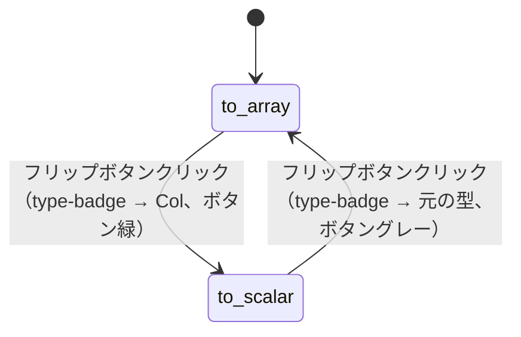
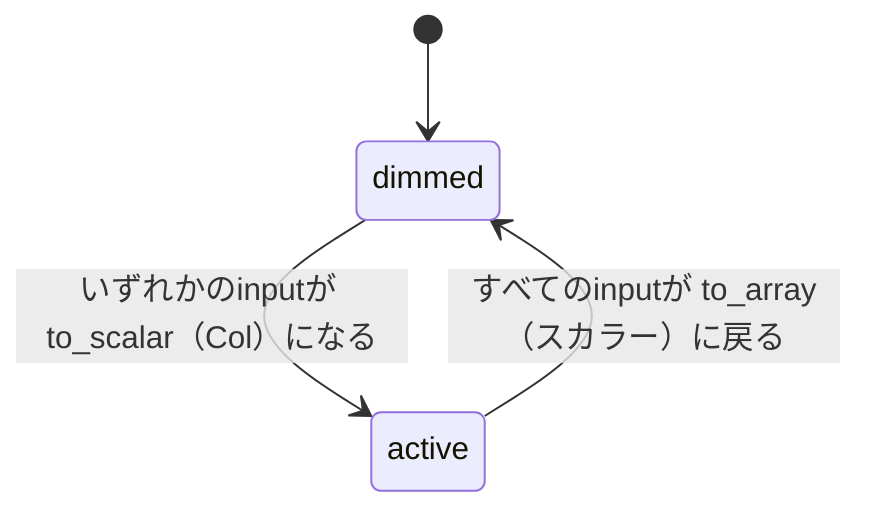

# 11 — Map/ZipコンテナノードUI 仕様

対応モック: `docs/mockups/11-map-zip-node/`

---

## 概要

Map/ZipComponentは**コンテナ型ノード**。内側にFormula（またはFlow）Componentのスロットを持ち、ドロップされたComponentのポート構成を継承して動作する。

| | MapComponent | ZipComponent |
|---|---|---|
| 適用方式 | 全組み合わせ（nD） | 要素ごと |
| output型 | `nDMap` | `Col`（固定） |
| 固有設定 | Column軸選択 | Column軸選択 + LengthMode |

---

## ノード構造

```
.container
  .container-header     ← ⊞ Map: {formulaName} / ⊞ Zip: {formulaName}
  .container-body
    .ports-col.inputs   ← ドロップ後に動的生成
    .container-slot     ← formulaをドロップするエリア
    .ports-col.outputs  ← ドロップ後に動的生成
  .container-footer     ← 常時表示（Column軸選択 / LengthMode）
```

---

## カラーテーマ

03-component-nodes.md のMap/Zipテーマに準拠。

| 部位 | 値 |
|---|---|
| ヘッダー背景 | `rgba(129,140,248,0.18)` |
| アイコン色 | `#818cf8` |
| name色 | `#c7d2fe` |
| container外枠 | `rgba(129,140,248,0.25)` |
| slot dashed border（ドロップ前） | `rgba(129,140,248,0.35)` |

---

## ドロップ前（empty状態）

- `container-slot`: dashed border、中央に `drop formula here` ヒントテキスト
- `ports-col.inputs` / `ports-col.outputs`: 非表示
- ヘッダー: `⊞ Map:` / `⊞ Zip:`（formulaName部分は空欄 or グレーの `—`）
- `container-footer`: 表示されるがすべてdimmed（操作不可）

---

## formulaドロップ後（occupied状態）

- ヘッダーが `⊞ Map: {formulaName}` / `⊞ Zip: {formulaName}` に更新
- slotにformulaが収まる（formulaのハンドルは非表示）
- formulaのinput/outputポートをコンテナが継承して動的生成
- formulaの最小サイズ: 内側のKaTeXエリア + INPUTポート列 + OUTPUTポート列が収まるサイズ

---

## inputポート列（左側）

### ポート行レイアウト

```
handle | [flip-btn] | type-badge | var-name
```

03-component-nodes.md の共通レイアウトに準拠。

### フリップボタン

- 初期状態: `to array`（ボタンラベル、グレー）→ type-badgeは元のformula input型
- クリックで `to scalar`（ボタンラベル、緑）→ type-badgeが `Col` に変わる
- `to scalar` 状態のポートが1本以上あると、`container-footer` のColumn軸radioが有効化される

---

## outputポート列（右側）

- var-name: formulaのoutput var-nameをそのまま継承
- type-badge:
  - **Map**: `nDMap`（inputに `Col` が1本以上あれば常にnDMap）
  - **Zip**: `Col`（固定）
- inputが全部 `to array`（スカラー）のとき: outputはformulaのoutput型そのまま（nDMap/Colにならない）

---

## container-footer（常時表示）

ノード下部にhorizontal dividerを挟んで配置する設定エリア。

### Column軸選択（Map・Zip共通）

- `Col` ポートが1本もなければ: ラベルとradioをdimmed表示（操作不可）
- `Col` ポートが1本以上あれば: 有効化

```
Column axis
○ x   ← Col状態のinputポートのみ列挙
● y
```

- radioの選択肢: `Col` になっているinputポートのvar-nameを列挙
- 選択されたポートのedgeが `Column[T]` 型として扱われる軸になる

### LengthMode（Zipのみ）

Column軸選択の下に追加表示。常時表示（dimmedなし）。

```
Length mode
● min
○ max
○ zero_pad
○ error
```

| 選択肢 | 動作 |
|---|---|
| `min` | 最短のColumnに合わせる（デフォルト） |
| `max` | 最長のColumnに合わせる（短い側はnull埋め） |
| `zero_pad` | 最長に合わせ、短い側を0埋め |
| `error` | 長さ不一致でエラー |

---

## State Diagrams

### D-11-1: コンテナのSlot状態

（02-flow-canvas.md D-02-3 と同内容。参照のみ）

### D-11-2: inputフリップ状態



> `to_scalar` 状態のポートが1本以上あるとき、footer の Column軸 radio が有効化される。

### D-11-3: Column軸radioの有効/無効


