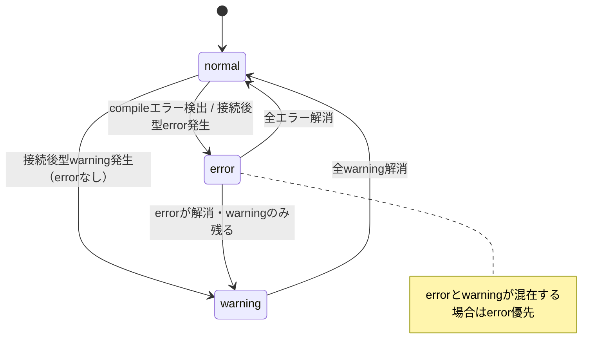
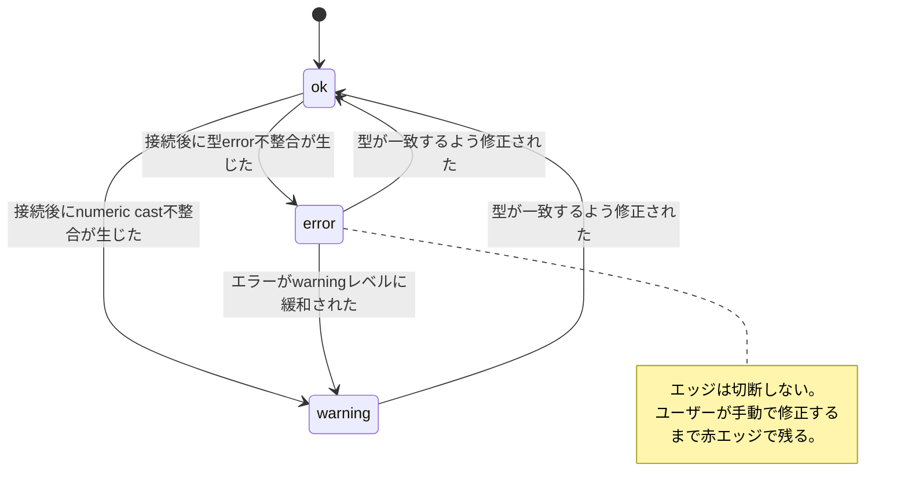

# 12 — エラー・型不整合フィードバック仕様

対応モック: `docs/mockups/02-flow-canvas.html`（既存モックにwarnカラー修正を適用）

---

## Severityカラー定義

Flowキャンバス上のエラー表示で使うカラーを統一する。

| Severity | 用途 | カラー |
|---|---|---|
| error | 型error・compileエラー | `#ef4444`（赤） |
| warning | numeric implicit cast（型warn） | `#eab308`（黄） |

> warnをオレンジではなく黄色にする理由: errorの赤との視覚的対比を大きくし、
> warning（許容範囲）とerror（接続不可）を一見で区別できるようにするため。

---

## ノード枠エラー表示

### 表示条件

| 条件 | Severity | 枠色 |
|---|---|---|
| バックエンドcompileエラーに含まれるノード | error | 赤（`#ef4444`） |
| 接続後に型不整合エッジを持つノード | error | 赤（`#ef4444`） |
| warning（numeric cast）エッジのみを持つノード | warning | 黄（`#eab308`） |
| errorとwarningが混在する場合 | error優先 | 赤（`#ef4444`） |

### スタイル

```
box-shadow: 0 0 0 1.5px {severity-color}
```

通常のノード枠（`border: 1px solid rgba(255,255,255,0.08)`）の外側にglow風で重ねる。

### インタラクション

ノード枠クリック（エラー状態時）→ デバッグパネルをオープン（PROBLEMSタブ）し、
該当ノードに関連するエラー行にフォーカス。
双方向ナビゲーション仕様の詳細は `docs/spec/10-debug-panel.md` を参照。

---

## エッジエラー表示

### 接続後の型不整合エッジ

エッジ接続後（または接続先Formulaの引数型変更後）に型不整合が生じた場合、
エッジを切断せず赤エッジで残す。ユーザーに手動での修正を促す。

> ドラッグ中に型errorのポートへは接続できない（`✕` overlay）。
> 接続後に不整合が生じるケースは「Formula引数型変更」「DatabaseTableスキーマ変更」等。

### エッジのSeverity別スタイル

| Severity | エッジ線色 | 中点バッジ | バッジ表示内容 |
|---|---|---|---|
| ok | デフォルト（白系） | 緑（`#4ade80`） | 型名のみ（例: `Col`） |
| warning | 黄（`#eab308`） | 黄（`#eab308`） | cast形式（例: `F64→I32`） |
| error | 赤（`#ef4444`） | 赤（`#ef4444`） | cast形式（例: `Col→F64`） |

### 型チェックルール（ダミー・Phase 2時点）

```
同型         → ok
numeric同士  → warning（I32 / I64 / F32 / F64 間）
それ以外     → error
```

> 型システムの本設計はPhase 5で行う。

---

## state diagram

### D-12-1: ノード枠のエラー状態



### D-12-2: エッジのエラー状態


